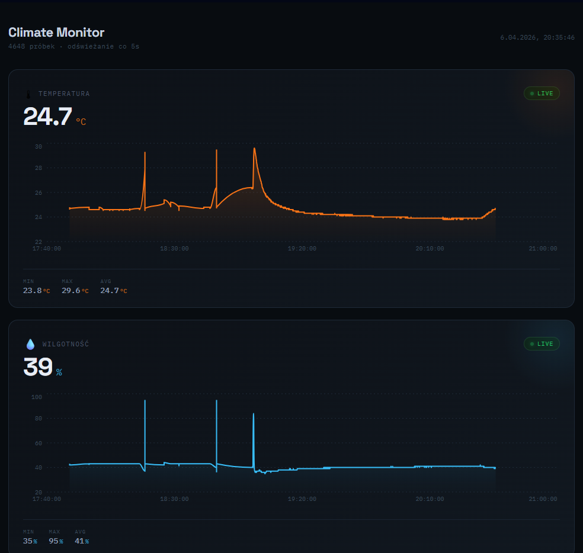

# 🏠 SmartHome System

System IoT do zbierania, przetwarzania i wizualizacji danych środowiskowych w czasie rzeczywistym.  
Rozwiązanie łączy warstwę embedded (ESP32), backend (FastAPI) oraz frontend analityczny.

---

## 📌 Przegląd projektu

System umożliwia:

- ciągły pomiar temperatury i wilgotności
- transmisję danych z urządzenia ESP32 do API
- zapis danych w lokalnej bazie SQLite
- wizualizację danych w formie wykresów czasowych
- analizę zmian parametrów środowiskowych

Architektura jest modułowa i może być rozszerzona o kolejne czujniki oraz funkcje automatyzacji.

---

## 🧱 Architektura systemu

| Warstwa   | Technologia | Odpowiedzialność |
|------------|-------------|------------------|
| Embedded   | ESP32 (Arduino C++) | Odczyt danych z czujników i wysyłanie do API |
| Backend    | FastAPI + SQLAlchemy | Przetwarzanie i zapis danych |
| Database   | SQLite | Lokalne przechowywanie pomiarów |
| Frontend   | React + Recharts | Wizualizacja danych i dashboard |

---

## 🔄 Przepływ danych

1. ESP32 wykonuje pomiar (temperatura, wilgotność)
2. ESP32 wysyła dane przez MQTT do brokera
3. Serwer MQTT odbiera wiadomość i przekazuje dane dalej przez HTTP POST do backendu
4. FastAPI waliduje dane i zapisuje je w SQLite
5. Frontend cyklicznie pobiera dane z API
6. Dane są renderowane jako wykresy czasowe

---

## 📊 Model danych

Każdy rekord pomiarowy zawiera:

- `temperature` – temperatura w °C
- `humidity` – wilgotność w %
- `created_at` – znacznik czasu pomiaru

---

## ⚙️ Stack technologiczny

**Hardware**
- ESP32
- czujniki temperatury i wilgotności

**Backend**
- Python
- FastAPI
- SQLAlchemy
- SQLite

**Frontend**
- React
- Recharts
- REST API

---

## 📈 Funkcje systemu

- zbieranie danych w czasie rzeczywistym
- zapis historii pomiarów
- wykresy trendów (temperatura / wilgotność)
- prosta architektura REST
- możliwość łatwej rozbudowy o kolejne sensory

---

## 🚀 Możliwe rozszerzenia

- integracja z Home Assistant
- automatyzacja (przekaźniki, sterowanie urządzeniami)
- system alertów (progi temperatury / wilgotności)

---

## 🧪 Status projektu

System działa w wersji podstawowej:

- ESP32 → OK
- API → OK
- baza danych → OK
- frontend / wykresy → OK

---

## 📷 Podgląd

---

## 👤 Autor

Projekt edukacyjny IoT łączący systemy embedded, backend i frontend w jeden spójny pipeline danych.